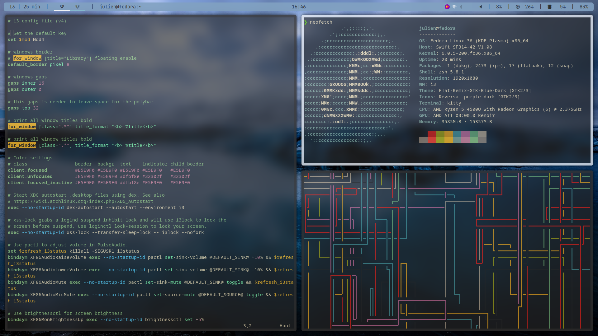
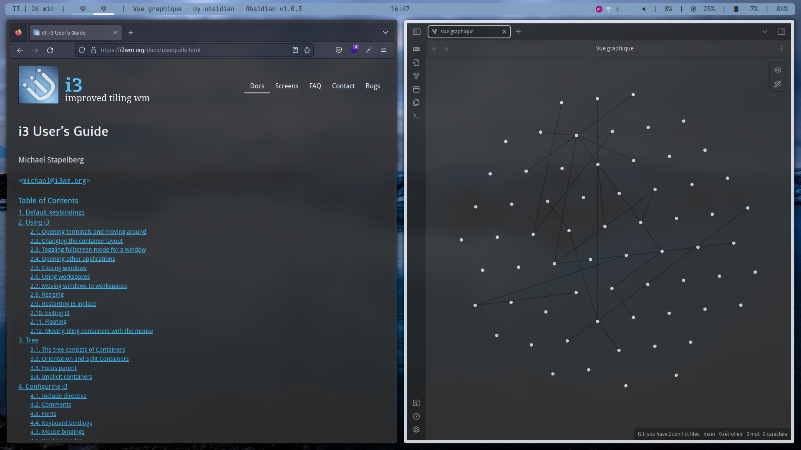
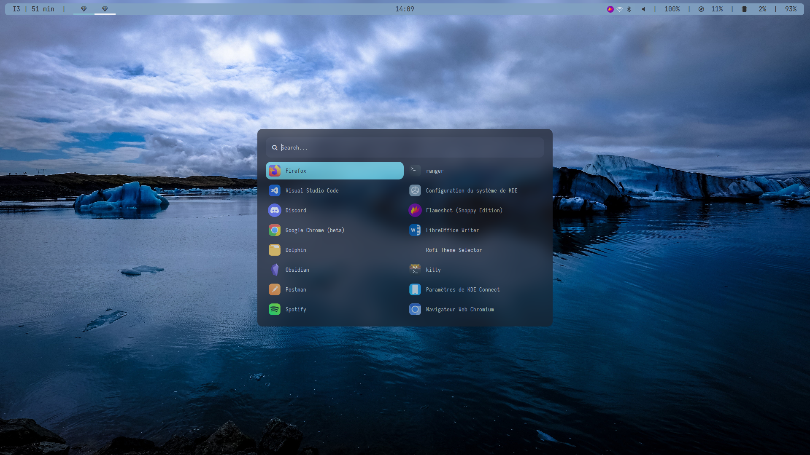

<div align="center">
<h1>Dotfiles</h1>


<br>

This repo contains all the utilities from my i3 configuration, feel free to pick up and modify as your needs.
</div>

## Requirements

Depending of your needs, you have to install this to reproduce the configuration.

- <a href="https://i3wm.org/">I3</a> - The tiling window manager
- <a href="https://github.com/yshui/picom">Picom</a> The compositor (blurring effects etc)
- <a href="https://github.com/polybar/polybar">Polybar</a> - The status bar
- <a href="https://github.com/davatorium/rofi">Rofi</a> - The menu(s)
- <a href="https://github.com/derf/feh">Feh</a> - The Wallpaper viewer (optional)
- <a href="https://www.python.org/downloads/">Kitty</a> - The terminal (optional)
- <a href="https://ohmyz.sh/">Zsh</a> - The Shell (optional)


<br>
<div align="center">
<h1>Screenshots</h1>
<a>
<br><br>

<br><br>

</a>

<br>

</div>
<div align="center">

# Locations

Please, read and modify ```configs.ini``` files to provide your own PATH to scrips/images etc.
</div>

## I3

Make sure to use the correct PATH for rofi menu(s), wallpaper.


I3 folder location :

```
~/.config/i3
```

## Picom

Picom folder location :

```
~/.config/picom
```

## Polybar

Come with a python script for Spotify.

Polybar folder location :

```
~/.config/polybar
```

## Rofi

Rofi folder location :

```
~/.config/rofi
```
